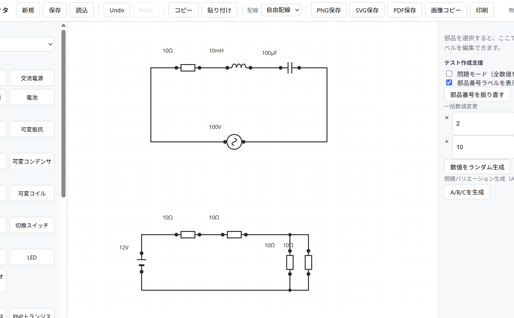
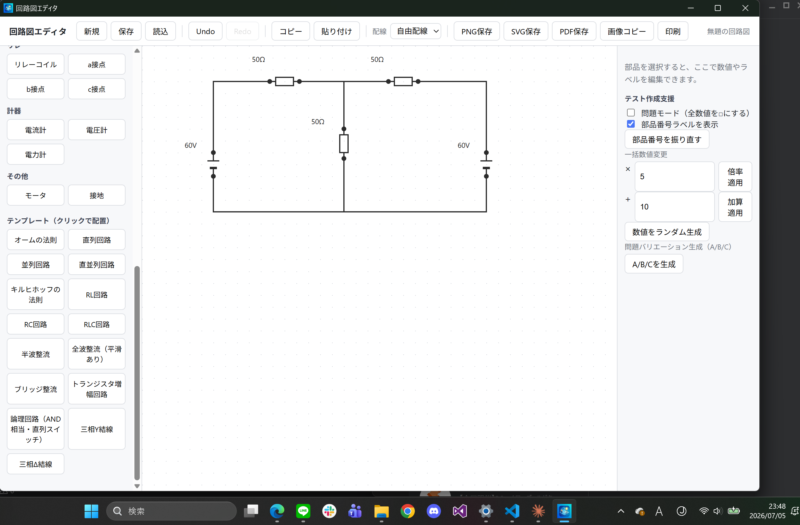
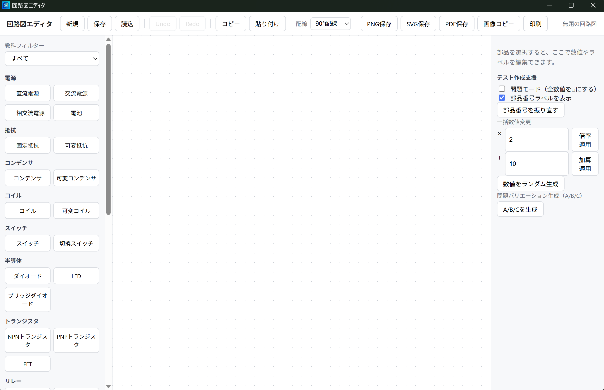

<div align="center">

# ⚡ Circuit Editor

### 工業高校・高専・電気学習向け回路図エディタ

教材・授業プリント・試験問題の作成を効率化するために開発した  
**Windows対応のデスクトップ回路図エディタ**です。

[]()
[]()
[]()
[]()
[]()

---

## 📥 ダウンロード

最新版は **Releases** からダウンロードできます。

➡ **GitHub右側の「Releases」より最新版をダウンロードしてください。**

</div>

---

# 📷 スクリーンショット




### メイン画面



---


# 📖 概要

Circuit Editor は、**工業高校の電気科教員**が教材や授業資料を作成する際に、
誰でも直感的に回路図を作成できることを目的として開発しました。

一般的なCADソフトは高機能である一方、
教育現場では不要な機能も多く、操作が複雑になりがちです。

本ソフトは

- 必要な部品だけを簡単に配置できる
- 授業で扱う回路図を素早く作成できる
- 初学者でも扱いやすいUI

をコンセプトとして設計しています。

---

# ✨ 主な機能

## 回路編集

- 🔋 回路部品の配置
- 📏 配線作成
- 🔄 部品回転
- ✂ コピー・貼り付け
- 🗑 削除
- 📌 範囲選択

---

## ファイル操作

- 💾 保存
- 📂 読み込み
- 🖨 印刷

---

## 編集支援

- ↩ Undo
- ↪ Redo
- 🔍 ズーム
- 🖱 ドラッグ操作

---

# 🚀 インストール方法

1. GitHub の **Releases** を開く
2. 最新版の

```
CircuitEditor_x64-setup.exe
```

をダウンロード

3. セットアップを実行

以上でインストール完了です。

---

# 💻 動作環境

|項目|内容|
|----|----|
|OS|Windows 10 / Windows 11|
|CPU|64bit|
|インストール|Setup.exe|

---

# 🛠 使用技術

|技術|用途|
|----|----|
|React|UI|
|TypeScript|フロントエンド|
|Tauri|デスクトップアプリ|
|Rust|バックエンド|
|Vite|ビルド環境|

---

# 📚 開発背景

私は工業高校の電気科教員として授業を行っています。

教材や試験問題を作成する中で、

- 回路図を作成するのに時間がかかる
- 教育用途に適したソフトが少ない
- よく使う部品だけを素早く配置したい

という課題を感じていました。

その課題を解決するため、
教育現場で実際に使うことを目的として
Circuit Editor を開発しました。

---

# 🚧 今後追加予定

- [ ] 回路部品の追加
- [ ] SVG出力
- [ ] PDF出力
- [ ] Web版
- [ ] ショートカットキー追加
- [ ] 自動配線補助
- [ ] ダークモード

---

# 📂 プロジェクト構成

```
circuit-editor
│
├── src/               # React
├── src-tauri/         # Rust
├── public/
├── package.json
└── README.md
```

---

# 🤝 フィードバック

バグ報告や改善案は Issue よりお気軽にお知らせください。

Pull Request も歓迎します。

---

# 📄 ライセンス

MIT License

---

<div align="center">

### ⭐ このプロジェクトが役に立ったら Star をいただけると励みになります！

Made with ❤️ using **React**, **TypeScript**, **Rust** and **Tauri**

</div>